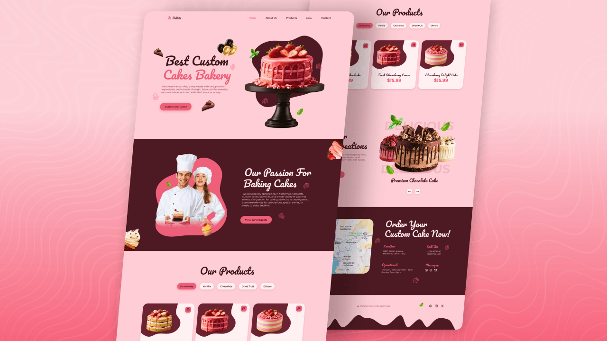

# 🎂 Responsive Cake Website

A modern, responsive and visually engaging cake shop website built using HTML, CSS, and JavaScript.
This project focuses on delivering a smooth user experience with elegant UI design, animations, and interactive components.

---

## 🚀 Live Demo

👉 [View Live Project](#) *(https://responsive-cake-website-alamin.netlify.app/)*

---

## 📌 Project Overview

The **Responsive Cake Website** is designed to showcase a bakery or cake business online.
It includes product displays, smooth animations, and responsive layouts to ensure a seamless experience across all devices.

---

## ✨ Features

* 📱 **Fully Responsive Design**
  Built with a mobile-first approach to ensure compatibility across mobile, tablet, and desktop devices.

* 🧱 **Semantic HTML Structure**
  Clean and well-organized markup for better accessibility and SEO.

* 🎨 **Modern CSS Design System**
  Uses CSS variables, Flexbox, and Grid for scalable and maintainable styling.

* ⚡ **Interactive Navigation Menu**
  Mobile-friendly menu with toggle functionality and auto-close behavior.

* 🎡 **Swiper.js Integration**
  Smooth and responsive sliders for showcasing cakes and new products.

* 🎞️ **ScrollReveal Animations**
  Engaging animations triggered on scroll for better user experience.

* 🔝 **Scroll-to-Top Button**
  Improves navigation on long pages.

* 🎯 **Active Link Highlighting**
  Navigation links dynamically update based on scroll position.

* 🌐 **Cross-Browser Compatibility**
  Works seamlessly across all modern browsers.

* 🚀 **Performance Optimized**
  Lightweight and fast-loading design.

---

## 🛠️ Technologies Used

* HTML5
* CSS3 (Variables, Flexbox, Grid)
* JavaScript (ES6)
* Swiper.js
* ScrollReveal.js
* Remix Icons

---

## 📂 Project Structure

```bash
responsive-cake-website/
│
├── index.html
├── assets/
│   ├── css/
│   │   └── styles.css
│   ├── js/
│   │   └── main.js
│   ├── img/
│   │   └── images & assets
│
└── README.md
```

---

## ⚙️ Key Functionalities

### 🔹 Navigation

* Responsive mobile menu
* Auto close on link click

### 🔹 Sliders

* Home section creative slider
* Product category slider (tabs + swiper)
* New products carousel

### 🔹 Scroll Effects

* Sticky header with shadow on scroll
* Active section highlighting
* Scroll-up button visibility

### 🔹 Animations

* Smooth reveal animations with delay control
* Section-wise animation triggers

---

## 📸 Screenshots



---

## 🧠 Learning Outcomes

* Improved understanding of responsive design
* Practical use of CSS Grid & Flexbox
* Integration of third-party libraries (Swiper, ScrollReveal)
* DOM manipulation and event handling in JavaScript
* Building clean and maintainable UI structure

---

## 🔧 Future Improvements

* 🛒 Add shopping cart functionality
* 🔐 User authentication system
* 📦 Backend integration for orders
* 🌍 Multi-language support
* 💳 Payment gateway integration

---

## 👨‍💻 Author

**Al Amin**

* 💼 Frontend Developer
* 🌐 Portfolio: *(Add your portfolio link)*
* 📧 Email: *(Your email)*
* 🔗 LinkedIn: *(Your LinkedIn link)*

---

## ⭐ Show Your Support

If you like this project, consider giving it a ⭐ on GitHub!

---
